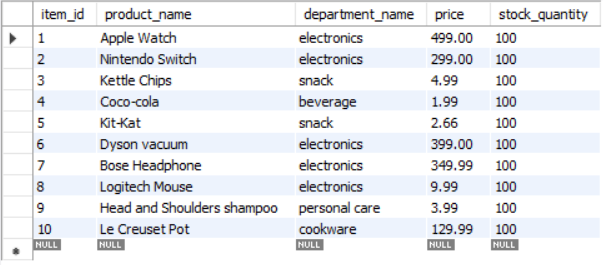
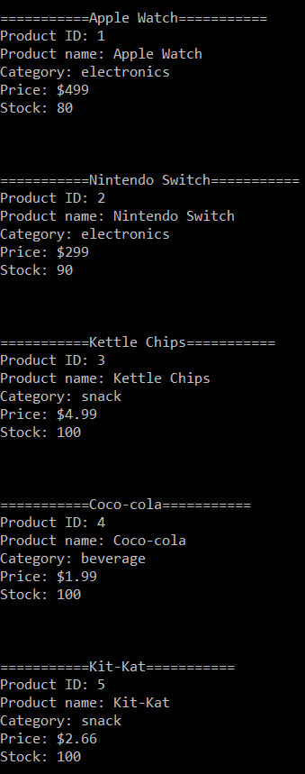
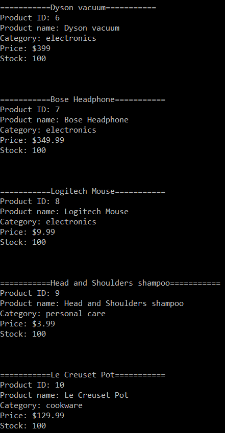
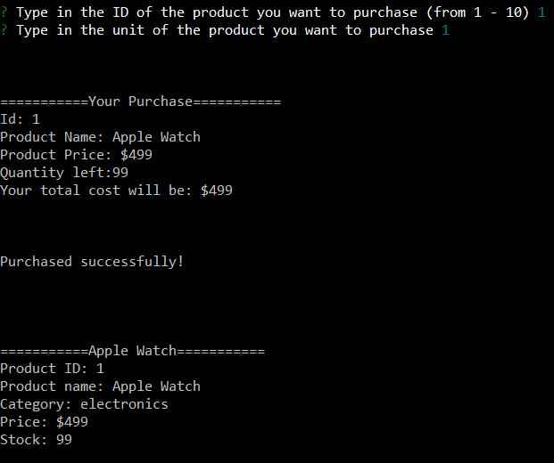
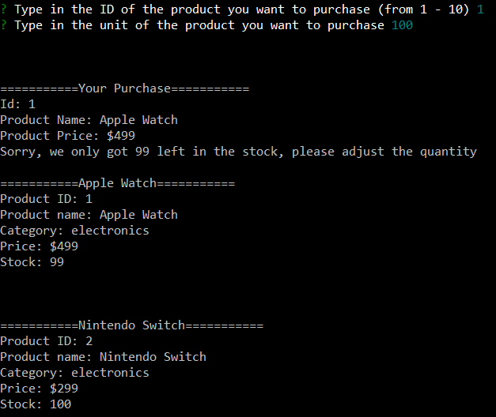
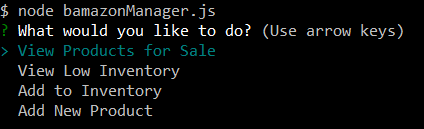
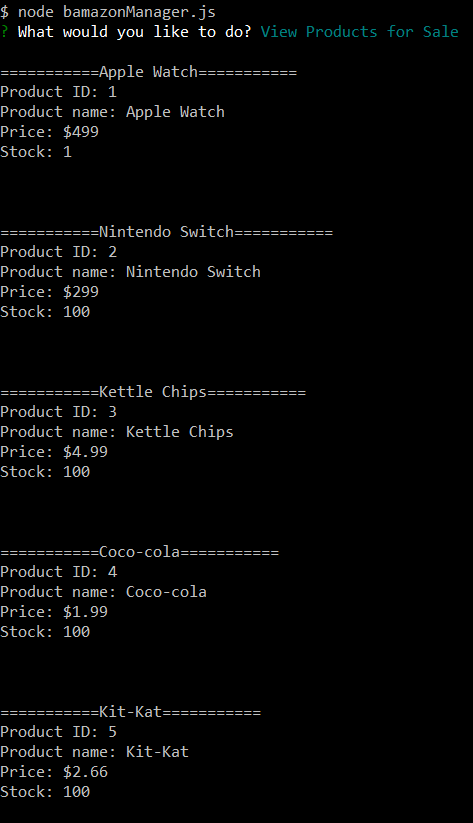
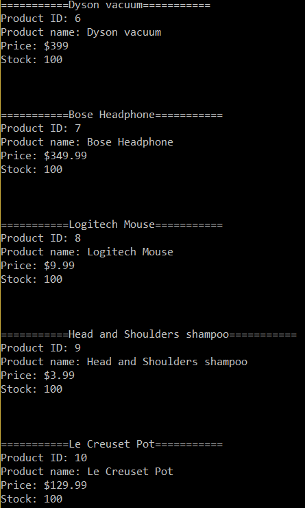
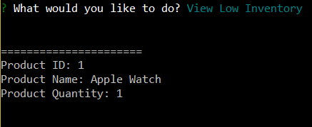

# bamazon

## Overview

The app will take in orders from customers and deplete stock from the store's inventory.

## GitHub Page

[GitHub Page](https://csdojo.github.io/bamazon/)

## bash
git clone 
git@github.com:csdojo/bamazon.git

## npm installation

npm init -y

npm install

npm install mysql inquirer

## create 10 mock products in database

:alien:

## bash how to type in command line

========bamazon Customer========

node bamazonCustomer.js

You can see all products info in the command. 

? Type in the ID of the product you want to purchase (from 1 - 10) 1
? Type in the unit of the product you want to purchase 1

? Type in the ID of the product you want to purchase (from 1 - 10) 1
? Type in the unit of the product you want to purchase 100

=========bamazon Manager========

node bamazonManager.js

## file mount
[js#1]:bamazonCustomer.js

[json#1]:package-lock.json
[json#2]:package.json

[sql#1]:db/schema.sql
[sql#2]:db/seeds.sql